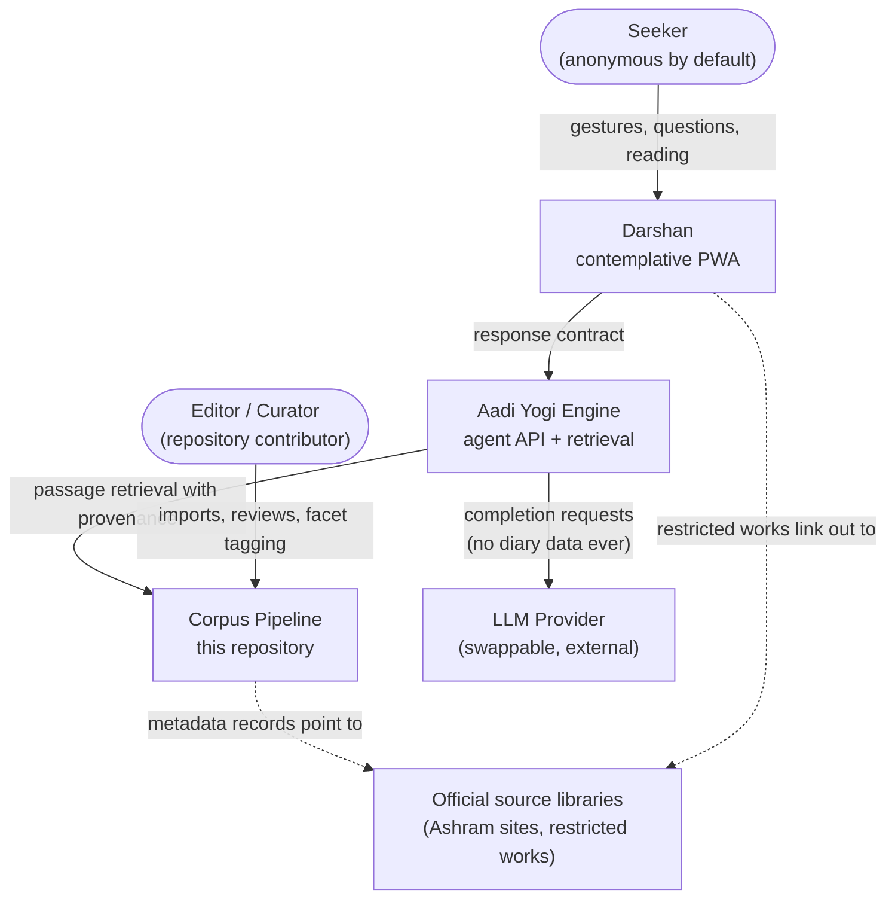
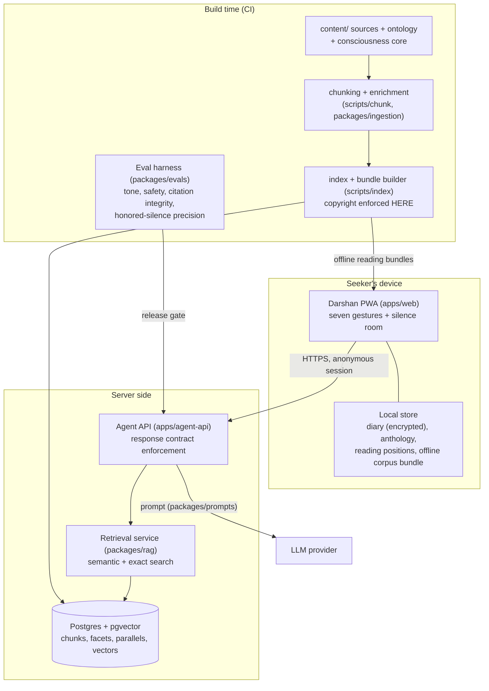
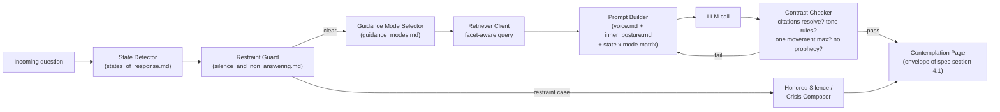

# C4 Model - Darshan over the Aadi Yogi Monorepo

Produced following `journey.yaml` next action `architecture` (c4-modeler).
Diagrams use flowchart notation labeled by C4 level so they render on GitHub.

## Level 1 - System Context

## Level 2 - Containers

## Level 3 - Components of the Agent API

## Component Responsibilities and Homes

| Component | Home | Notes |
| --- | --- | --- |
| Seven gestures UI + depth dial | `apps/web` | PWA; tokens from `design-tokens.yaml`; silence room has zero telemetry |
| State detector | `apps/agent-api` | classifier prompt + heuristics; restraint cases short-circuit |
| Guidance mode selector | `apps/agent-api` | maps state x question type to modes |
| Prompt builder | `packages/prompts` | consciousness core compiled into system prompts |
| Retriever | `packages/rag` | passage-level chunks with facets and provenance payloads |
| Chunker / enricher | `packages/ingestion`, `scripts/chunk` | canonical-structure-aligned passage ids (library law) |
| Index + bundle builder | `scripts/index` | copyright filter at build time; offline bundles for reading rooms |
| Contract checker | `apps/agent-api` | rejects/regenerates on citation or tone failure |
| Eval harness | `packages/evals` | golden questions, honored-silence precision, presence metrics |

## Architectural Decisions (draft ADRs)

1. **Copyright at build time, not prompt time**: restricted works never enter
   quotable indexes; the model cannot leak what retrieval cannot see.
2. **Diary is client-side only**: the agent API has no diary endpoints except
   the single witness-mode invitation, which sends one entry transiently and
   stores nothing.
3. **D1 meanings are content, not generation**: batch-drafted, editorially
   reviewed, versioned in the corpus - so the most-read layer is the most
   reviewed layer.
4. **LLM provider behind one interface**: the response contract is enforced
   on our side; providers are swappable without behavioral change.
5. **Offline-first reading**: reading rooms ship as static bundles; only the
   Inquiry requires the network, and says so plainly.
